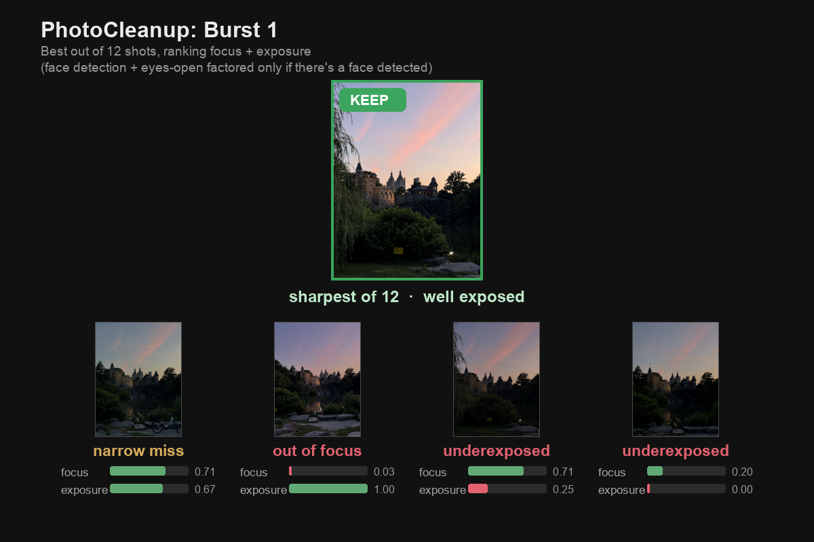

# PhotoCleanup

Groups near-duplicate photos, ranks each group by quality, and suggests which one to keep. It never deletes anything. Photos you reject get moved to a `delete_candidates/` folder for potential review/recovery. 



## What it does

- Groups near-duplicate shots (a burst of the same scene) so you review the group once instead of frame by frame. 
- Scores each photo in a group on three things: eyes open, focus, and exposure.
- Recommends which to keep and which to drop.
- Reads iPhone HEIC files in the web uploader. The CLI and folder mode read JPG/PNG.

## How it works

1. Hash every photo with a pHash.
2. Group photos whose hashes are within a Hamming distance of 15, using union-find.
3. Score each photo in a group, normalize the scores within the group, and combine them by weight:

   | signal | how it's measured | weight |
   |---|---|---|
   | eyes open | MediaPipe face landmarks, eye-aspect-ratio | 0.50 |
   | focus | variance of the Laplacian (the face if one is found, else the whole image) | 0.35 |
   | exposure | share of pixels not clipped to pure black or white | 0.15 |

4. Keep the top N in each group (N is spread across the library by group size, at least 1 per group). A photo with no near-duplicates is marked "maybe."

Face detection also runs on overlapping tiles of the image, not just the full frame, because small faces get missed at full resolution. Face scores are cached in SQLite so re-runs are fast.

## Setup

```bash
python3 -m venv .venv
source .venv/bin/activate
pip install -r requirements.txt
```

The MediaPipe face model (about 4 MB) downloads on first run.

## Usage

Command line, prints recommendations for a folder:

```bash
python -m photocleanup <folder> [threshold] [keep_total]
```

Web app, to review and export:

```bash
python -m photocleanup.server
```

Open http://127.0.0.1:8000, upload photos or point it at a folder, review each group in the grid, compare, or swipe views, then Approve to download a `keep` + `delete_candidates` zip, or clean the folder in place.

## Project layout

```
photocleanup/
  hashing.py     pHash + folder listing
  distances.py   Hamming distance
  clustering.py  union-find near-duplicate grouping
  ranking.py     focus, exposure, eyes-open, tiled face detection
  scoring.py     normalize + weight signals, allocate keeps
  cache.py       SQLite cache of face results
  server.py      FastAPI app + endpoints
  static/        upload + results pages (vanilla JS)
  __main__.py    CLI entry point
```

## Stack

Python, imagehash, Pillow + pillow-heif, OpenCV, MediaPipe, FastAPI, SQLite, and vanilla JS on the frontend.
